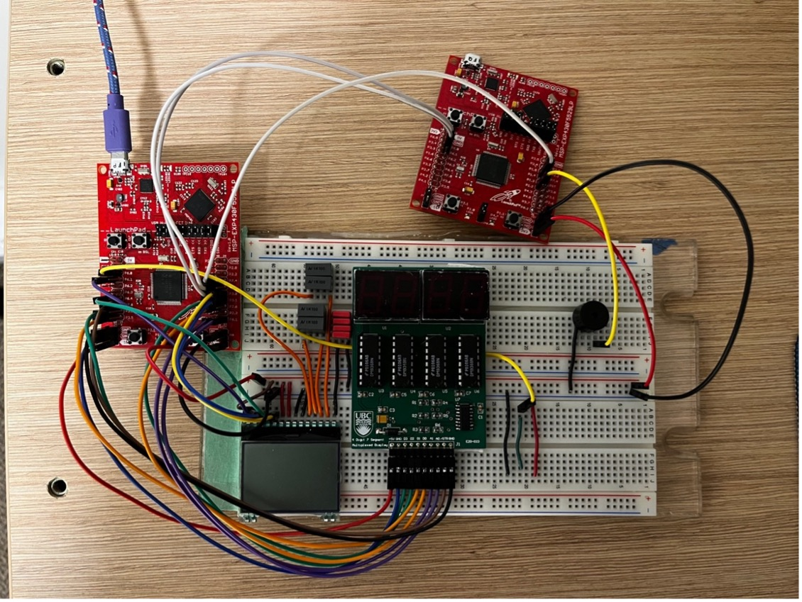
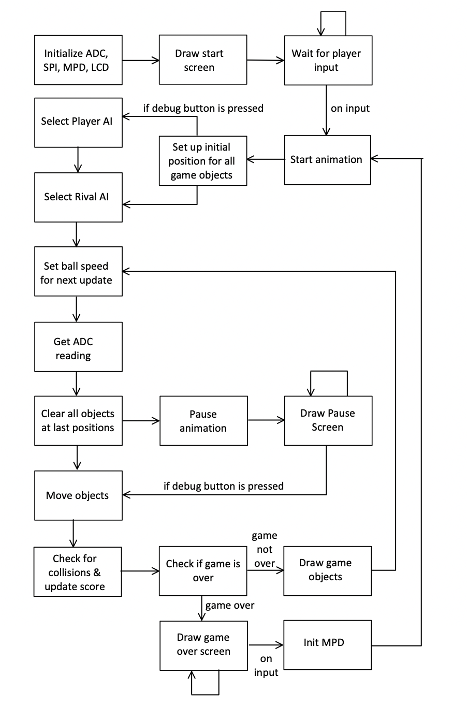

# Introduction:

The Pong game, a seminal arcade game developed in the 1970s, simulates
table tennis and has sustained its influence within the gaming industry.
As one of the earliest video games, it serves as an ideal subject for
implementation in a portable game console. The motivation behind this
project was to create an entertaining and engaging Pong game that can be
played on an MSP430 microcontroller, exploring the potential of embedded
systems in game development. This project focused on the development of
an interactive Pong game using an MSP430 microcontroller and an LCD
display, adhering to the scientific principles and technical
requirements necessary for creating a portable and engaging gaming
experience.

# Theory:

The project is grounded in several theoretical concepts, including the
Serial Peripheral Interface (SPI) for LCD display communication and
Risk-Reward Balancing for engaging gameplay.

Serial Peripheral Interface (SPI) is a synchronous, full-duplex serial
communication protocol frequently employed for short distance
communication between microcontrollers and peripheral devices, such as
sensors, memory devices, and display modules. Its simplicity, speed, and
ease of implementation, along with its low cost, have made it widely
adopted in embedded systems.

SPI communication involves a master device and one or more slave
devices, with data transmission occurring via four signal lines:

1.  Master Out Slave In (MOSI): This data line sends data from the
    master device to the slave device(s).

2.  Master In Slave Out (MISO): This data line sends data from the slave
    device(s) back to the master device.

3.  Serial Clock (SCLK): The master device generates this clock signal
    to synchronize data transmission between the master and slave
    devices.

4.  Chip Select (CS): This line is used by the master device to select
    the specific slave device it wants to communicate with. Each slave
    device has its own SS/CS line.

For our purposes, as the LCD display does not output any data, we only
require the MOSI, SCLK, and CS lines.

The game design and logic were informed by the risk and reward balancing
of the game, as these elements directly influence player behavior,
engagement, and satisfaction. Key aspects of risk and reward include
game balance, player motivation, decision-making, uncertainty and
anticipation, and feedback and consequences. Incorporating these
elements creates a sense of challenge and accomplishment, fostering an
immersive and enjoyable experience for the player.

1.  Game Balance: Achieving a balance between challenges (risks) and
    incentives (rewards) ensures that players remain engaged and
    motivated, as they feel their efforts are adequately rewarded. Game
    balance can be accomplished through iterative design, playtesting,
    and adjustments to difficulty levels, reward structures, and in-game
    mechanics.

2.  Player Motivation: Risk and reward play a significant role in
    motivating players to continue playing. Intrinsic motivation (e.g.,
    exploration, problem-solving, competition) and extrinsic motivation
    (e.g., points, rewards, achievements) can both drive players to take
    risks.

3.  Decision-making: Players assess potential risks and rewards of their
    actions and make choices accordingly. Developers can manipulate
    these factors to create scenarios that encourage strategic thinking
    and meaningful choices, leading to more engaging gameplay.

4.  Uncertainty and Anticipation: Uncertainty in a game\'s risk-reward
    structure contributes to excitement and anticipation. Randomized
    rewards or unpredictable outcomes can make taking risks more
    thrilling and encourage different strategies. However, balancing
    predictability and unpredictability is crucial to avoid frustration.

5.  Feedback and Consequences: Clear feedback on the outcomes of
    players\' decisions helps them understand the risks and rewards
    associated with their actions. Effective feedback can be visual,
    auditory, or tactile and should communicate the consequences of
    choices. When players experience meaningful consequences, they are
    more likely to learn from their decisions and adapt their
    strategies, creating a deeper sense of immersion and engagement.

# Apparatus:

Figure 1 Assembled Game Console (missing potentiometer)

Figure 2 High level diagram of the game console. Figure 3 Circuit
diagram

1.  Primary MSP: The Primary MSP managed all game logic, excluding
    audio. It converted the potentiometer value using ADC on pin 6.0 and
    employed it as the primary game input. A button on P2.1 functioned
    as a debug button, leading to additional inputs primarily used for
    debugging the game. The MSP had one file that utilized inputs to
    change states or send commands to the LCD display for drawing game
    changes. The Primary MSP sent 3 bits of information to the Audio
    Playback MSP for playing specific audio when required. Two bits were
    used to select one of the four pre-selected tracks, and the other
    bit served as a trigger. Player scores were updated on the multiplex
    display, with the two leftmost displays used for the player and the
    two rightmost for the computer.

2.  LCD Display (EA DOGS 102N-6): The display used SPI for
    communication. In addition to the three pins required for receiving
    data from the MSP, the display featured a RESET pin, Command/Data
    pin, four bias generator pins, four power supply pins, and a Power
    LC Drive pin.

    a. RESET: Grounding the reset pin reinitializes all control
    registers to their default state.

    b. Command/Data: Two types of data were communicated to the
    display: drawing data and control data.

        i.  Low: Control Data

        ii. High: Display Data

    c. Bias generator: The bias voltage pins on an LCD module provide
    the necessary bias voltages to control individual segments of
    the LCD display. These bias voltages ensure proper operation and
    high-quality image output.

    d. Power supply: Used to power the display\'s RAM.

    e. Power LC Drive: Used to drive the LCD. A capacitor connected to
    the ground reduces noise. The power to drive the LCD is
    generated internally using a charge pump and seven capacitors.

3.  Audio Playback MSP and Piezo Buzzer: To play music on the MSP, we
    used knowledge from lab 4 to approximate pure notes. An array of
    frequencies allowed us to play any desired note, and delay cycles
    could be used to modulate the BPM of the piece. Audio was offloaded
    to a separate MSP to avoid interrupting game execution. An interrupt
    on P1.4 was set up, and the interrupt service routine selected audio
    from an array or switch statement using the select value received
    from P6.0 and P6.1.

4.  Potentiometer: The potentiometer was connected across 3.3V and
    ground. Its output was directly fed into the primary MSP using
    PIN6.0.

5.  7-Segment Display: The 7-segment display functioned as a scoreboard
    and was set up similarly to the configuration in lab 2.

6.  Debug Button: Initially used for debugging purposes, such as
    selecting player AI and pausing script execution, the debug button
    eventually incorporated pause animations, transforming the pause
    functionality into a deliberate feature of the game.

# Code:

 
All the code for this game was developed by me, except for the text
display functions and SPI communication function.

The control flow of the entire program is depicted in Figure 4. The
program initializes all the required settings and pins on the MSP, then
sets up a game upon receiving player input. This process is more complex
than it appears because the potentiometer signal contains noise even
after being bit-shifted by 6. A dead zone variable is introduced to
differentiate between actual player input and random noise.

Figure 4 Control flow of entire program

### Game Logic

In the game, you control a paddle aiming to score 5 points against the
computer. Points are scored by making the ball pass the opponent\'s side
of the screen. The ball\'s speed increases every 100 game cycles after
hitting the paddle, up to a certain limit. When the ball hits a paddle,
its y-velocity changes depending on the point of impact. Hitting the
corner increases y-velocity the most, while x-velocity remains
unchanged, allowing for a more challenging bounce.

When the ball hits a paddle, it's y velocity is altered depending on
where it has been hit. Hitting on the corner increases y velocity the
most, while the x velocity stays the same. This allows the ball to
bounce more which makes it harder for players and most AIs coded into
the game.

### The AIs

An AI is selected using a 6-bit reading from the potentiometer, which is
further bit-shifted to produce a 2-bit number for indexing the AIs. The
AIs are stored in an array of function pointers to facilitate this
process. Extensive playtesting was conducted to ensure the AIs were
beatable and to identify bugs.

For example, the Andrzej AI was initially unbeatable because it would
just follow the ball. During testing, the ball was able to phase through
players, leading us to believe that Andrzej AI was beatable. However,
after fixing the phasing issue, the AI became unbeatable again. To
address this, randomness was added to the AI\'s behavior, ensuring that
it would occasionally miss the ball by a pixel.

Most testing was carried out against other AIs, which primarily
motivated the implementation of a secret player AI selection menu. This
feature allowed for extensive testing of the game to ensure that all AIs
were beatable and to identify any bugs.

The game features four different AIs:

1.  Predictive (Mr. Frog): The most complex but easiest to beat AI, Mr.
    Frog tries to predict the ball\'s position and move there. It has a
    speed limitation and makes mistakes 15% of the time.

2.  Edge Hitter (Dinel): Dinel aims to hit the ball on the edge of the
    paddle, opting for high-risk, high-reward plays. This AI introduces
    players to the ball movement mechanic and is more challenging than
    Mr. Frog.

3.  Zeno\'s Paradox (Raveel): Raveel moves half the distance towards the
    ball in each frame, often hitting the edge. However, it is coded to
    aim for the center, making this AI more challenging without being
    too monotonous for the player.

4.  Middle Hitter (Andrzej): This defensive AI always tries to hit the
    ball in the middle, with some randomness added to occasionally miss
    by one pixel. It is the most difficult AI for humans to beat as it
    avoids risky moves and rarely misses.

### Game screens:

!
Figure 5 Title Screen
[A close-up of a label Description
automatically generated with low
confidence](images/fig6.jpg)
Figure 6 Difficulty Select Screen

Figure 7 Gameplay screens. On the left screen you can see the trailing
effect

Figure 8 Pause screen animations.

Figure 9 Game over screen when AI (Raveel) wins

# Results:

The game performed as expected, although some challenges were
encountered during development. We will discuss these challenges in the
following section:

1.  Paddle drawing and clearing across pages: The paddle\'s horizontal
    movement meant data had to be sent in parts. When a paddle crossed a
    page, the previous page\'s final row still had a line drawn on it.
    To fix this, a clear function was introduced, which led to screen
    flickering due to the constant drawing and clearing of the image.
    The initial solution of precomputing the screen and sending it in
    chunks was slow. The final solution was to send arrays the size of
    the items being drawn and cleared, which resolved the flickering
    issue.

2.  Ball drawing and size issue: Reusing the paddle drawing code for the
    ball caused the ball\'s size to change when moving through pages.
    Adjusting the byte being set for the 8 pixels resolved the issue.

3.  Audio Playback MSP and PWM: An issue occurred when using PWM and
    interrupts simultaneously on the MSP. The interrupt could only be
    triggered once, so the MSP was reset every time it was interrupted
    to fix the issue.

4.  Ball phasing through paddle: The ball would phase through the paddle
    when its speed increased past a certain point. To fix this, the
    hitbox for checking collisions was increased, and the ball\'s speed
    was limited.

In conclusion, the game\'s development process involved addressing
various challenges related to data handling, display control, and code
optimization. The AI component provided varying levels of difficulty,
enhancing the overall gameplay experience. Despite the encountered
issues, the game was successfully developed and functioned as expected.

In addition to meeting the design goals, the Pong game received positive
feedback from players. Several of my friends who played the game enjoyed
it, with some playing for an hour straight. This anecdotal evidence
demonstrates the game\'s ability to engage players and provide a
challenging, enjoyable experience.

# Discussion:

Overall, the project was successful, with the interactive Pong game
offering engaging gameplay and multiple AIs. The challenges faced during
development, such as data handling and display control, were mitigated
through careful code optimization and design considerations.

Future improvements could include:

1.  Advanced AI algorithms: Developing AI opponents that adapt to the
    player\'s skill level or improve their performance using
    reinforcement learning would make the game more engaging and
    challenging.

2.  Improved 7-segment display: A display capable of showing leading
    zeros would enhance the game\'s scoring system. Currently, the game
    cannot display a 0-0 score.

3.  Bigger and better display: A larger screen would provide a more
    comfortable gaming experience and reduce the trailing effect of the
    current display.

4.  More game features: Adding a button for interrupt-based events would
    enable the implementation of various interesting features.
    Currently, the project relies on the potentiometer as the primary
    input, which limits the game to time-based events.

By addressing these potential improvements, the Pong game could become
even more engaging and enjoyable for players, offering an enhanced
gameplay experience with more varied features and challenges.

Conclusion:

In conclusion, the interactive Pong game successfully achieved its
design goals, offering engaging gameplay with multiple AIs and a
functional user interface. The game received positive feedback from
players, indicating that it provided an enjoyable and challenging
experience. Although some challenges were faced during development,
these were addressed through careful code optimization and design
considerations. Potential future improvements could include more
advanced AI algorithms, a better display, and additional game features
that leverage interrupt-based events. Overall, the project demonstrates
the potential of embedded systems to create interactive and entertaining
games.

Acknowledgements:

We would like to extend our special thanks to those who contributed to
the project:

- Felix Klose, who provided code for drawing text that was originally
  ported from the Arduino library for the display.

- Raveel Tejani, who suggested the idea for the Zeno\'s paradox AI
  implementation.

- Ben Scully, who inspired the pause screen animation.

- Sajjan Grewal, Dinel Anthony, Luke Vance, and Ben Scully, who
  assisted with playtesting and reporting bugs.

- The SPI protocol code was adapted from the course website \[3\].

# References:

1.  http://dbindner.freeshell.org/msp430/data/uc1701.pdf

2.  <https://www.mouser.ca/datasheet/2/127/dogs102_6e-2942018.pdf>

3.  <http://dbindner.freeshell.org/msp430/lcd_spi.html>
